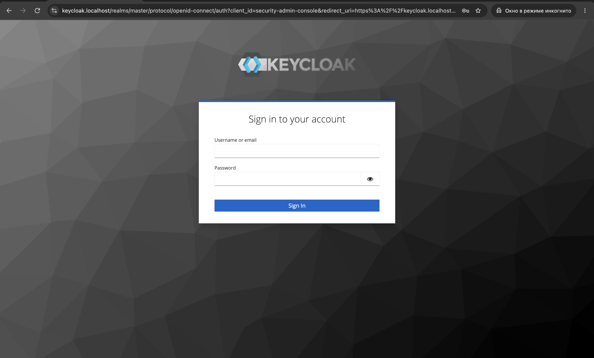
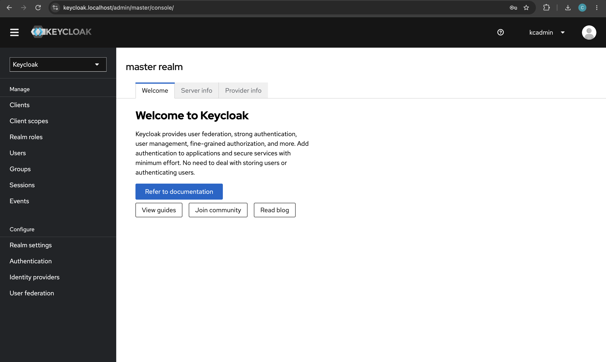
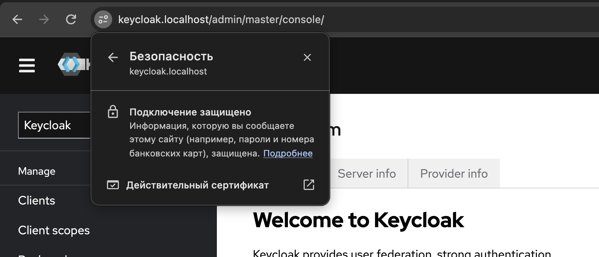
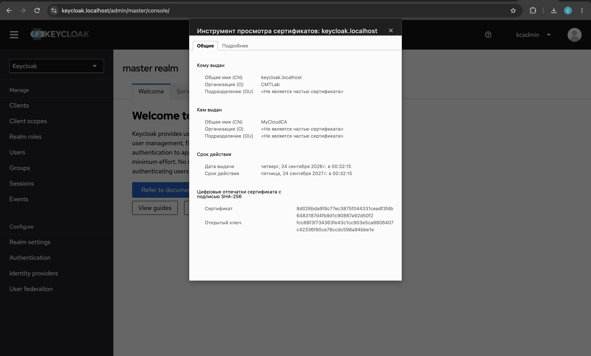
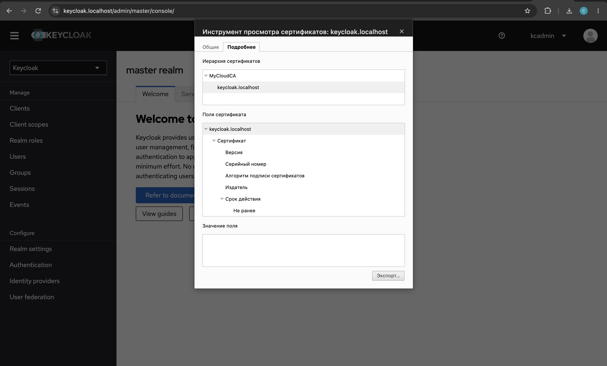
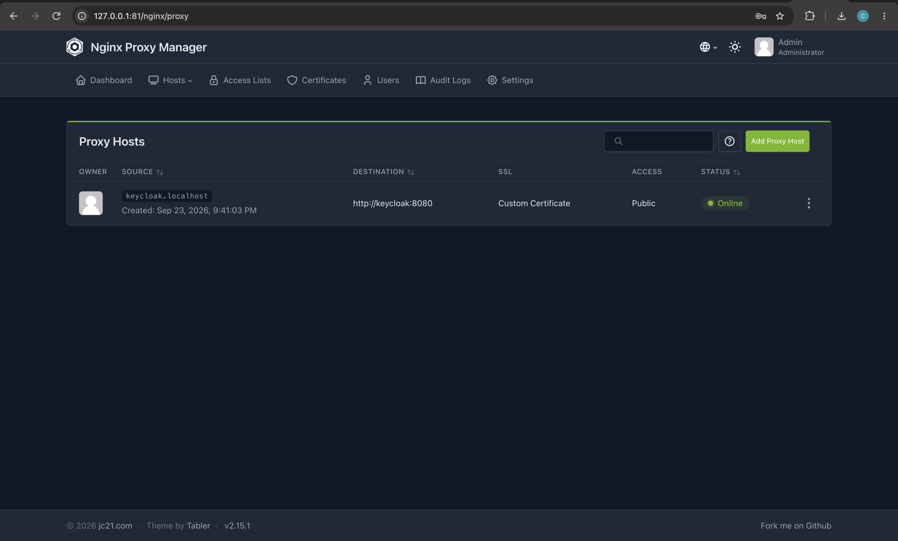

# Домашнее задание: поднимаем Keycloak

Докер-композиция с системой авторизации Keycloak на базе образа `quay.io/keycloak/keycloak:24.0`.

| Оценка | Папка | Что сделано |
|---|---|---|
| 6 | `1_dev/` | Keycloak в dev-режиме (`start-dev`) |
| 8 | `2_prod/` | Keycloak в продовом режиме (`start --optimized`) + PostgreSQL |
| 10 | `3_npm_cert/` | Продовый Keycloak за Nginx Proxy Manager с самоподписанным сертификатом |

Во всех композициях учтено из лекции:

- секреты лежат в `.env` (в git не попадает, есть `.env.example`), пароли генерируются через `secrets.token_urlsafe`, умолчанных паролей нет;
- `restart: unless-stopped`, ограничение логов (`max-size`/`max-file`), лимиты ресурсов, healthcheck, тома для данных;
- лишние порты не открыты: Keycloak публикуется только на `127.0.0.1`, а в варианте на 10 наружу смотрят только 80/443 NPM (админка NPM на 81 — тоже только `127.0.0.1`);
- `depends_on` с `condition: service_healthy`: Keycloak ждёт готовности БД;
- в варианте на 10 PostgreSQL живёт в отдельной сети `backend` и недоступен из `npm-network`.

## Результат (на 10)

Страница входа Keycloak по `https://keycloak.localhost`:



Вход в админку под `kcadmin`:



Chrome считает соединение защищённым:



Сертификат выдан на `keycloak.localhost` собственным центром сертификации `MyCloudCA`:





Proxy Host в Nginx Proxy Manager с самоподписанным (Custom) сертификатом:



---

Генерация пароля:

```bash
python3 -c "import secrets; print(secrets.token_urlsafe(48))"
```

---

## На 6 — dev-режим

```bash
cd 1_dev
cp .env.example .env        # вписать KEYCLOAK_ADMIN_PASSWORD
docker compose up -d
```

Открыть http://localhost:8080 и войти под `kcadmin` с паролем из `.env`.
В dev-режиме Keycloak работает по HTTP со встроенной БД H2 (данные в томе `kc_dev_data`).

Остановка: `docker compose down -v`

## На 8 — продовый режим

```bash
cd 2_prod
cp .env.example .env        # вписать KEYCLOAK_ADMIN_PASSWORD и DB_PASSWORD
docker compose up -d --build
```

- `Dockerfile` собирает образ по рекомендации Keycloak для прода: multi-stage, на первом этапе `kc.sh build`
  «запекает» БД `postgres` и health/metrics, итоговый контейнер стартует с `start --optimized`;
- БД — PostgreSQL 16 в томе `pgdata`;
- в логах видно `Profile prod activated`.

Продовый режим по умолчанию требует HTTPS. Здесь HTTP включён (`KC_HTTP_ENABLED`) только потому, что порт
доступен лишь с `127.0.0.1`. Полноценный TLS — в варианте на 10.

Открыть http://localhost:8080 → `kcadmin` / пароль из `.env`.

## На 10 — самоподписанный сертификат через NPM

Схема: браузер → `https://keycloak.localhost` (443) → NPM (TLS-терминация) → `http://keycloak:8080` по сети `npm-network`.
Keycloak настроен как сервис за reverse-proxy: `KC_PROXY_HEADERS=xforwarded`, `KC_HOSTNAME=keycloak.localhost`.

Домен `keycloak.localhost` без правки `hosts` резолвится в `127.0.0.1` (Chrome и curl так делают для `*.localhost`).
Другой домен можно задать в `keycloak/.env` (`DOMAIN=...`) и передать его в `gen-certs.sh`.

### 1. Выпустить центр сертификации и серверный сертификат

```bash
cd 3_npm_cert
./certs/gen-certs.sh                  # или ./certs/gen-certs.sh мой.домен
```

Команды те же, что на слайде «Создаем центр сертификации», но расширения передаются через `-extfile`,
потому что в macOS вместо OpenSSL стоит LibreSSL, а он не знает `-copy_extensions`.
Появятся `ca.crt`/`ca.key` (центр сертификации `MyCloudCA`) и `server.crt`/`server.key` (сертификат с SAN `DNS:keycloak.localhost`).

### 2. Создать докер-сеть

```bash
docker network create npm-network
```

### 3. Поднять NPM

```bash
cp npm/.env.example npm/.env          # вписать NPM_ADMIN_PASSWORD
cd npm && docker compose up -d && cd ..
```

Админ NPM создаётся из `.env` при первом запуске, так что умолчанный `admin@example.com / changeme` не используется.

### 4. Поднять Keycloak

```bash
cp keycloak/.env.example keycloak/.env   # вписать пароли
cd keycloak && docker compose up -d --build && cd ..
```

### 5. Подключить сертификат в NPM

Автоматически: `./npm-setup.sh` (делает то же самое через API NPM).

Или вручную в http://127.0.0.1:81:

1. **SSL Certificates → Add SSL Certificate → Custom**: Name `keycloak.localhost`,
   Certificate Key `certs/server.key`, Certificate `certs/server.crt`.
2. **Hosts → Proxy Hosts → Add Proxy Host**:
   - *Details*: Domain `keycloak.localhost`, Scheme `http`, Forward Hostname `keycloak`, Port `8080`,
     включить *Block Common Exploits* и *Websockets Support*;
   - *SSL*: выбрать загруженный сертификат, включить *Force SSL* и *HTTP/2 Support*;
   - *Advanced*: увеличить буферы, иначе на больших cookie Keycloak бывает `502 Bad Gateway`:
     ```nginx
     proxy_buffer_size 128k;
     proxy_buffers 4 256k;
     proxy_busy_buffers_size 256k;
     ```

### 6. Добавить сертификат в браузер

- Chrome: `chrome://certificate-manager/` → *Local certificates* → *Custom* → **Import** `certs/ca.crt`
  (доверять для идентификации сайтов), затем `chrome://restart`.
- Для всей macOS сразу:
  `sudo security add-trusted-cert -d -r trustRoot -k /Library/Keychains/System.keychain certs/ca.crt`

### 7. Проверить

Открыть https://keycloak.localhost: соединение защищено, сертификат выдан `MyCloudCA`, `http://` редиректит на `https://`.
Войти в админку под `kcadmin`.

Проверка из консоли:

```bash
curl --cacert certs/ca.crt https://keycloak.localhost/realms/master/.well-known/openid-configuration
# issuer: https://keycloak.localhost/realms/master
```

Остановка:

```bash
(cd keycloak && docker compose down -v); (cd npm && docker compose down); docker network rm npm-network
```
